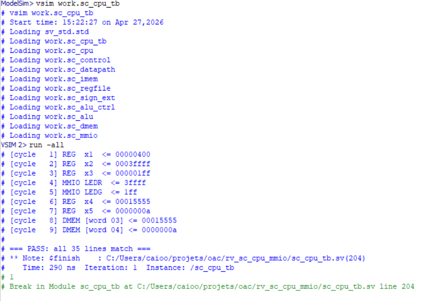

# 🖥️ RISC-V MMIO — Contador com Botões

<div align="center">


**Projeto acadêmico desenvolvido para a disciplina de Laboratório de Organização e Arquitetura de Computadores (CIN0012) — CIn/UFPE (2026)**

</div>

---

## 📌 Sobre o Projeto

Implementação de um **contador de 9 bits controlado por botões** rodando em um **processador RISC-V single-cycle** implementado em **SystemVerilog**, gravado em uma FPGA **DE2-115 (Altera Cyclone IV E)**.

O sistema é composto por:
- Um processador RISC-V completo (single-cycle) implementado em hardware
- Memória de instruções e memória de dados
- Interface de **Entrada e Saída Mapeada em Memória (MMIO)** para chaves, botões e LEDs
- Um programa em **assembly RISC-V** que implementa o contador com detecção de borda

---

## 📁 Estrutura do Projeto

```
rv_sc_cpu_mmio/
├── sc_top.sv           # Topo: conecta CPU aos pinos físicos da FPGA
├── sc_cpu.sv           # CPU: une controle + datapath
├── sc_control.sv       # Unidade de controle (decodifica opcode)
├── sc_datapath.sv      # Datapath: fluxo de dados do processador
├── sc_imem.sv          # Memória de instruções (ROM)
├── sc_dmem.sv          # Memória de dados (RAM)
├── sc_mmio.sv          # Controlador MMIO (SW, KEY, LEDR, LEDG)
├── sc_regfile.sv       # Banco de registradores (32 x 32 bits)
├── sc_alu.sv           # Unidade Lógica e Aritmética
├── sc_alu_ctrl.sv      # Controle da ALU
├── sc_sign_ext.sv      # Extensor de sinal
├── sc_cpu_tb.sv        # Testbench para simulação no ModelSim
├── pll_10mhz.v         # PLL: converte 50 MHz → 10 MHz
├── data.mif            # Inicialização da memória de dados
├── assembler/
│   ├── assembler.py    # Montador: assembly → instruction.mif
│   └── instructions.txt# Programa assembly do contador
├── modelsim/
│   ├── program.hex     # Programa de teste para simulação
│   ├── data.hex        # Dados de teste para simulação
│   └── golden.txt      # Saída esperada para verificação
└── quartus/
    └── sc_top.sdc      # Constraints de timing
```

| Arquivo | Descrição |
|---------|-----------|
| [`sc_top.sv`](sc_top.sv) | Módulo de topo — pinos físicos da DE2-115 |
| [`sc_datapath.sv`](sc_datapath.sv) | Núcleo do processador — fluxo de dados |
| [`sc_control.sv`](sc_control.sv) | Unidade de controle — decodifica instruções |
| [`sc_mmio.sv`](sc_mmio.sv) | Interface com periféricos via MMIO |
| [`assembler/instructions.txt`](assembler/instructions.txt) | Programa assembly do contador |
| [`data.mif`](data.mif) | Constantes inicializadas na memória de dados |

---

## 🏗️ Arquitetura do Sistema

```
                    ┌─────────────────────────────────┐
                    │           sc_top.sv             │
                    │   (pinos físicos da DE2-115)    │
                    │                                 │
                    │  ┌──────────────────────────┐   │
                    │  │        sc_cpu.sv         │   │
                    │  │                          │   │
                    │  │  sc_control  sc_datapath │   │
                    │  └──────────────────────────┘   │
                    └─────────────────────────────────┘
                                   │
              ┌────────────────────┼────────────────────┐
              │                    │                    │
        ┌──────────┐         ┌──────────┐        ┌──────────┐
        │ sc_imem  │         │ sc_dmem  │        │ sc_mmio  │
        │(programa)│         │ (dados)  │        │(periféri-│
        └──────────┘         └──────────┘        │   cos)   │
                                                 └──────────┘
```

O processador implementa o conjunto de instruções RISC-V RV32I (subconjunto), baseado no modelo single-cycle do livro *Patterson & Hennessy — Computer Organization and Design (RISC-V Edition)*.

---

## 🗺️ Mapa de Memória MMIO

| Endereço | Periférico | Operação | Descrição |
|----------|-----------|----------|-----------|
| `0x400`  | `SW[17:0]` | Leitura  | 18 chaves deslizantes |
| `0x404`  | `KEY[3:0]` | Leitura  | 4 botões (ativos em baixo) |
| `0x408`  | `LEDR[17:0]`| Escrita | 18 LEDs vermelhos |
| `0x40C`  | `LEDG[8:0]` | Escrita | 9 LEDs verdes |

O acesso é feito por instruções `lw` (leitura) e `sw` (escrita) nos endereços acima. O hardware detecta automaticamente se o endereço pertence à RAM ou ao MMIO pelo **bit 10** do resultado da ALU.

---

## 🎮 Funcionalidade do Contador

### Botões

| Botão | Ação |
|-------|------|
| `KEY[3]` | Incrementa o contador |
| `KEY[2]` | Decrementa o contador |
| `KEY[1]` | Zera o contador |
| `KEY[0]` | Reset geral (hardware) |

> ⚠️ Os botões são **ativos em baixo**: valor `0` quando pressionado, `1` quando solto.

### Saída

O valor do contador (32 bits internamente) é exibido nos **9 bits menos significativos** dos LEDs vermelhos (`LEDR[8:0]`) em binário — LED aceso = bit 1, LED apagado = bit 0.

---

## 🧠 Programa Assembly

### Registradores utilizados

| Registrador | Conteúdo |
|-------------|----------|
| `x1`  | Base MMIO (`0x400`) |
| `x2`  | Contador (32 bits) |
| `x3`  | Leitura atual dos botões (KEY) |
| `x4/x5/x6` | Temporários para detecção de borda |
| `x7`  | Máscara KEY[3] = `0x8` |
| `x8`  | Máscara KEY[2] = `0x4` |
| `x9`  | Máscara KEY[1] = `0x2` |
| `x10` | Máscara 9 bits = `0x1FF` |
| `x11` | Constante `1` |
| `x12` | Estado anterior dos botões (`prev_KEY`) |
| `x13` | Valor do contador mascarado para display |

### Instruções disponíveis

O processador suporta apenas: `lw`, `sw`, `beq`, `add`, `sub`, `and`. Como não há `addi`, **todas as constantes são pré-carregadas da memória de dados** via `lw`.

### Detecção de Borda

Para garantir que o contador muda **apenas uma vez por aperto** (e não fica repetindo enquanto o botão está segurado):

```
prev_mascarado = prev_KEY AND mascara_botao
curr_mascarado = curr_KEY AND mascara_botao
diferenca = prev_mascarado - curr_mascarado

# diferenca == mascara  →  botão acabou de ser pressionado (1 → 0)
# diferenca == 0        →  nenhuma mudança
```

### Estrutura do programa

```
INIT (instr. 0–7):    carrega constantes da memória + zera contador
UPDATE (instr. 8–10): exibe contador nos LEDs, lê estado dos botões
CHECK (instr. 11–24): verifica KEY[3], KEY[2], KEY[1] com detecção de borda
INC (instr. 25–27):   atualiza prev, contador++, volta ao UPDATE
DEC (instr. 28–30):   atualiza prev, contador--, volta ao UPDATE
ZER (instr. 31–33):   atualiza prev, contador = 0, volta ao UPDATE
```

### Código — `assembler/instructions.txt`

```asm
lw x1,0(x0)          ; x1  = 0x400 (base MMIO)
lw x7,4(x0)          ; x7  = 8     (máscara KEY[3])
lw x8,8(x0)          ; x8  = 4     (máscara KEY[2])
lw x9,12(x0)         ; x9  = 2     (máscara KEY[1])
lw x10,16(x0)        ; x10 = 0x1FF (máscara 9 bits)
lw x12,20(x0)        ; x12 = 0xF   (prev_KEY inicial)
lw x11,24(x0)        ; x11 = 1     (constante)
add x2,x0,x0         ; contador = 0

; UPDATE
and x13,x2,x10       ; x13 = contador & 0x1FF
sw x13,8(x1)         ; LEDR = x13  (endereço 0x408)
lw x3,4(x1)          ; x3  = KEY   (endereço 0x404)

; KEY[3] — incrementar
and x4,x12,x7
and x5,x3,x7
sub x6,x4,x5
beq x6,x7,44         ; se pressionado → INC

; KEY[2] — decrementar
and x4,x12,x8
and x5,x3,x8
sub x6,x4,x5
beq x6,x8,40         ; se pressionado → DEC

; KEY[1] — zerar
and x4,x12,x9
and x5,x3,x9
sub x6,x4,x5
beq x6,x9,36         ; se pressionado → ZER

; nenhum botão pressionado
add x12,x3,x0
beq x0,x0,-64        ; → UPDATE

; INC
add x12,x3,x0
add x2,x2,x11
beq x0,x0,-76        ; → UPDATE

; DEC
add x12,x3,x0
sub x2,x2,x11
beq x0,x0,-88        ; → UPDATE

; ZER
add x12,x3,x0
add x2,x0,x0
beq x0,x0,-100       ; → UPDATE
```

---

## ⚙️ Principais Conceitos Utilizados

| Conceito | Aplicação no Projeto |
|----------|----------------------|
| MMIO | Acesso a periféricos via `lw`/`sw` em endereços especiais |
| Edge detection | `prev_KEY` detecta a borda de descida do botão |
| Memória de dados | Armazena constantes já que não há `addi` |
| Branch offset | Saltos calculados manualmente em bytes relativos ao PC |
| PLL | Converte clock de 50 MHz para 10 MHz para a CPU |

---

## 🔄 Como Reproduzir

### 1. Montar o programa

```bash
cd assembler
python assembler.py
# gera: assembler/instruction.mif
```

### 2. Compilar no Quartus

- Abrir o projeto no Quartus Prime
- Copiar `instruction.mif` e `data.mif` para a pasta do projeto
- **Processing → Start Compilation**

### 3. Gravar na FPGA

- Conectar a DE2-115 via USB-Blaster
- **Tools → Programmer → Start**

### 4. Testar

| Ação | Resultado esperado |
|------|--------------------|
| Pressionar KEY[3] | Um LED a mais acende |
| Pressionar KEY[2] | Um LED a menos acende |
| Pressionar KEY[1] | Todos os LEDs apagam |
| Pressionar KEY[0] | Reset — contador volta a 0 |

---

## 🧪 Simulação (ModelSim)

Para verificar o hardware antes de gravar na FPGA, rode a simulação com o programa de teste:

```bash
cd modelsim
vlog -sv ../sc_alu.sv ../sc_alu_ctrl.sv ../sc_control.sv \
         ../sc_sign_ext.sv ../sc_regfile.sv               \
         ../sc_imem.sv ../sc_dmem.sv ../sc_mmio.sv        \
         ../sc_datapath.sv ../sc_cpu.sv ../sc_cpu_tb.sv

vsim work.sc_cpu_tb
run -all
# A saída deve bater com golden.txt — resultado: PASS
```

### Resultado



---

## 🏫 Contexto Acadêmico

| Campo | Informação |
|-------|-----------|
| Disciplina | Laboratório de Organização e Arquitetura de Computadores |
| Instituição | Centro de Informática – UFPE (CIn) |
| Professores | Edna Barros e Victor Medeiros |
| Linguagem | SystemVerilog + Assembly RISC-V |
| Ano | 2026 |

---

## 👥 Integrantes

| Nome | E-mail |
|------|--------|
| Caio Agrelli  | caarr@cin.ufpe.br |
| Lucas David   | ldlf@cin.ufpe.br  |
| João Gustavo  | jggp@cin.ufpe.br  |
| Thales Afonso | tadg@cin.ufpe.br  |
